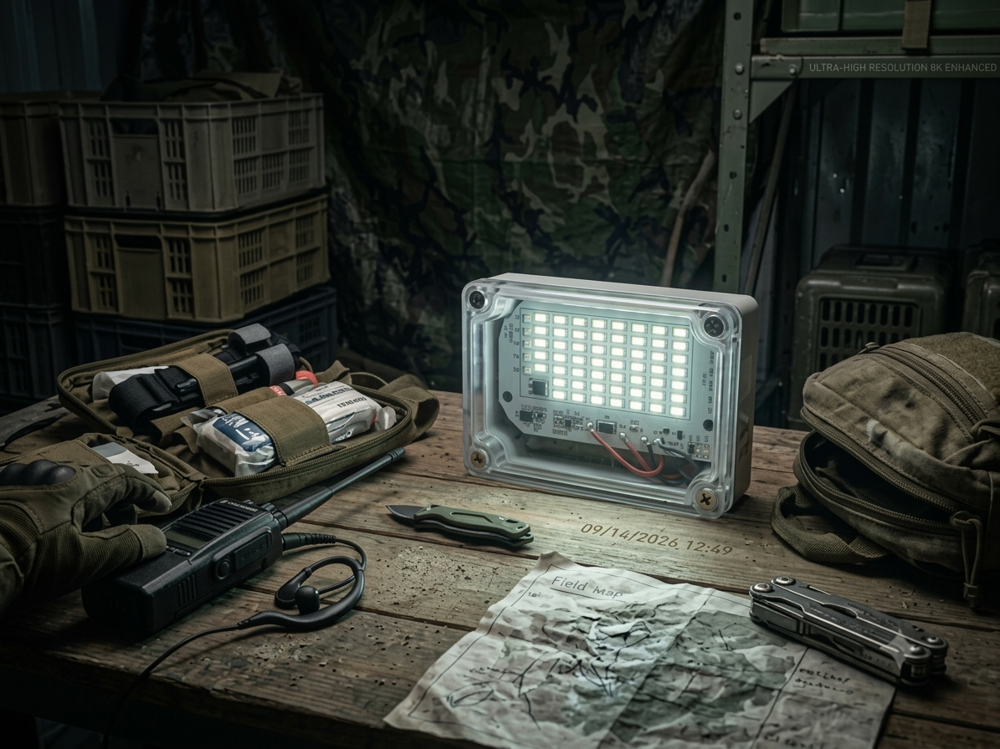

# Mini Floodlight

>*The light you can rely when everything goes dark.

### About the Product
Made of high quality, hand-picked materials. Compact, lightweight, and durable. Designed to be reliable in every emergency situation.

### Features
- Compact and durable build for easy everyday carry
- Water and splash resistant
- Supports fast charging with battery charge indicator
- Cross-compatible with 6v solar panels
- Continuous light up to 12 hours
- Wireless remote control feature

## How to Order
You can reach us via the following:  
Facebook:  
[DISALET PISOWIFI](https://www.facebook.com/share/19L1B9W38S/)  
Email:  
theinternetcommoner@gmail.com  
hungrianoadolf@gmail.com  
Mobile:  
09464249582

### Want to build one yourself?
Full control over your build. You can customize it to your needs and liking. Feel free to check on the list of materials used.

- 3 pieces 18650 battery (2200mAh each)
- 1 piece 12A 1S BMS (compatible with 18660 battery)
- 1 set LED Board 25w with remote 
- 1piece outdoor type electrical box with transparent cover (100mm * 68mm * 50mm)
- 2 pieces AAA battery (for the remote)
- wires, soldering lead, nickel strip (for assembly)